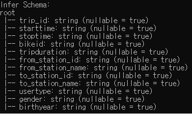
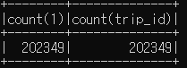
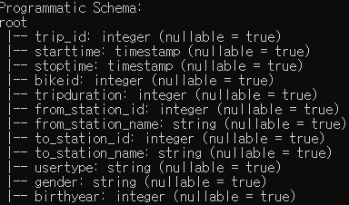
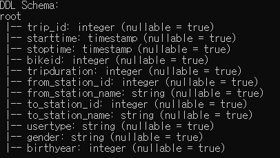
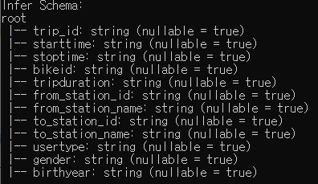
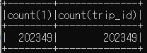
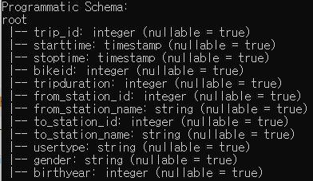
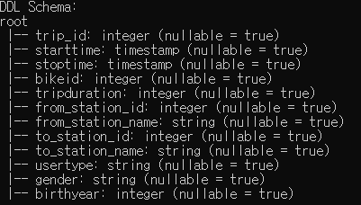

# 🚴 Divvy Trips Schema Demonstration with PySpark and Scala

This project demonstrates how to create and apply different Spark schemas using both **Python (PySpark)** and **Scala**. The analysis uses the Divvy Trips dataset to showcase schema creation methods in Spark, including inferred schemas, programmatic schemas, and DDL-based schemas.

## 📄 Overview
The goal of this project is to compare Spark applications in Python and Scala by implementing three schema assignment methods:
1. **Inferred Schema** - Automatically infers schema from the dataset.
2. **Programmatic Schema** - Uses `StructFields` to define schema programmatically.
3. **DDL (Data Definition Language) Schema** - Defines schema using DDL syntax.

## 💻 Running the Project
1. Ensure the `Divvy_Trips_2015-Q1.csv` file is in the same directory as the code files.
2. **Python (PySpark)**:
   Run the following command to execute the Python code:
   ```bash
   spark-submit divvy_schema.py
   ```

3. **Scala**:
   Compile the Scala code with **SBT** and then run it with:
   ```bash
   spark-submit --class DivvyTrips target/scala-2.12/DivvySchema_2.12-1.0.jar Divvy_Trips_2015-Q1.csv
   ```

## 📸 Screenshots
Below are sample screenshots of schema outputs for each method in both Python and Scala.

### Python Output
- **Inferred Schema**  
    
  

- **Programmatic Schema**  
    
  

- **DDL Schema**  
    
  

### Scala Output
- **Inferred Schema**  
    
  

- **Programmatic Schema**  
    
  

- **DDL Schema**  
    
  

## 🔎 Summary
This project demonstrates how to use Spark to process data with different schema assignment methods in both PySpark and Scala, allowing for a comparison between code structure and execution.

## 📝 Notes
- This project was executed on a local Spark cluster in a **Vagrant Ubuntu environment**.
- Remember to include the `build.sbt` file for Scala compilation.